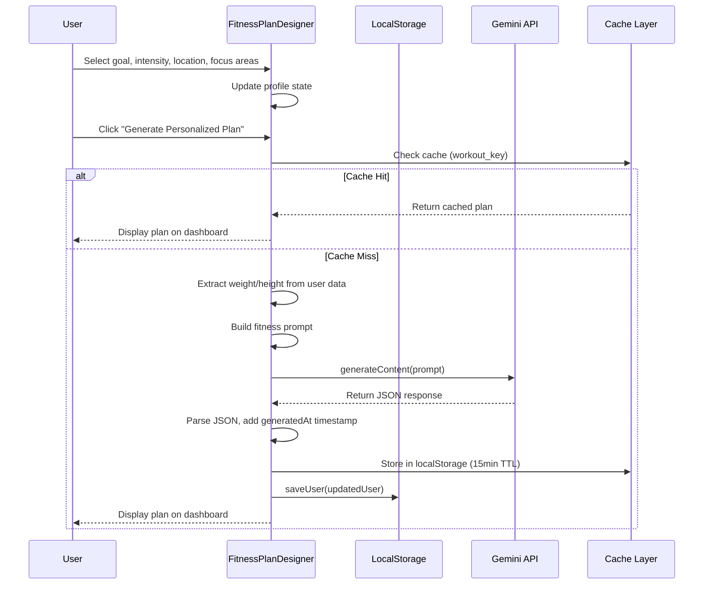
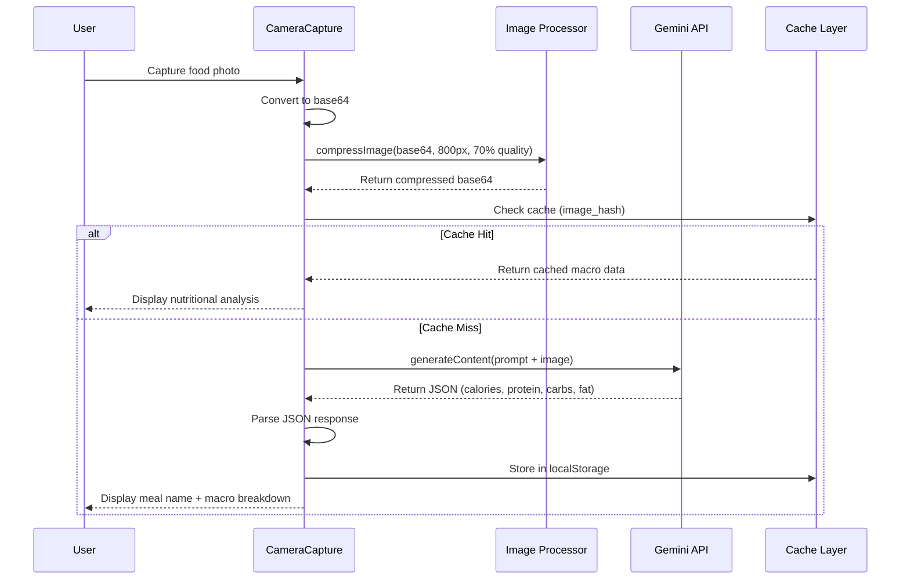
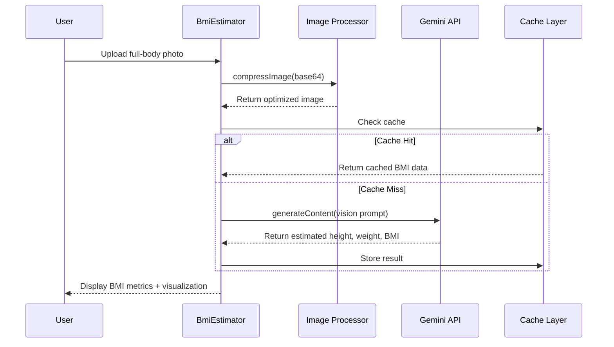
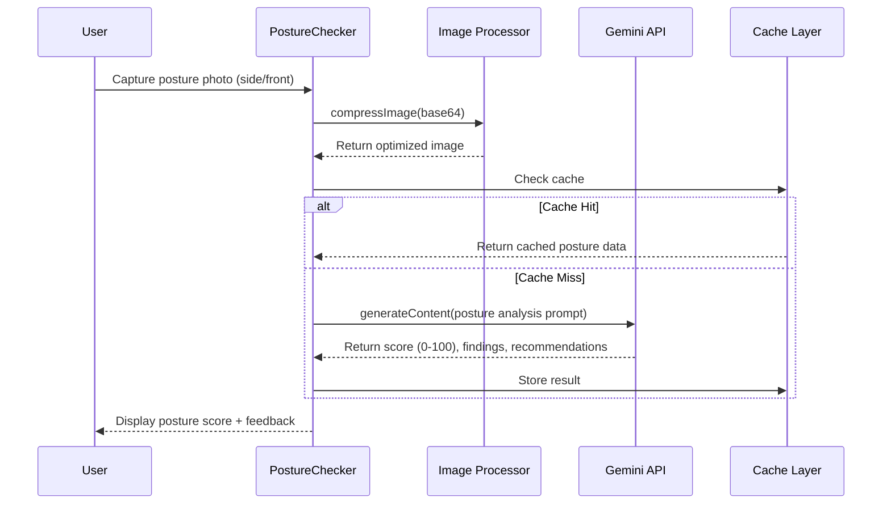
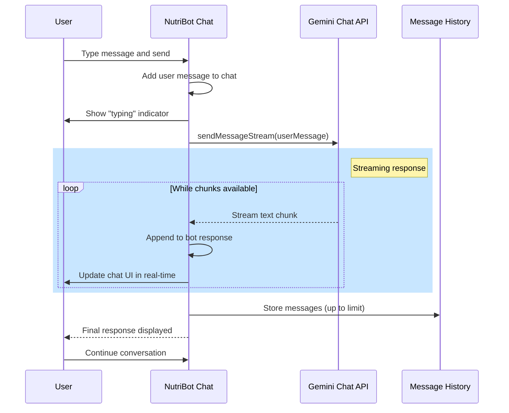
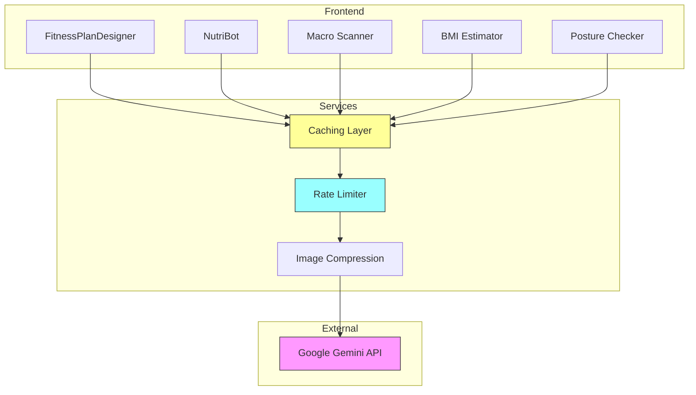

# Sequence Diagrams

## Table of Contents
1. [Fitness Plan Generation](#fitness-plan-generation)
2. [Macro Analysis](#macro-analysis)
3. [BMI Estimation](#bmi-estimation)
4. [Posture Check](#posture-check)
5. [NutriBot Chat](#nutribot-chat)

---

## Fitness Plan Generation

**Flow Description:**
1. User configures fitness preferences (goal, intensity, location, focus areas)
2. System generates a unique cache key from profile parameters
3. If cached result exists and is within 15-min TTL, return immediately
4. Otherwise, call Gemini API with structured prompt
5. Parse response and store in localStorage for future requests
6. Save to user profile in database
7. Display generated plan on dashboard

---

## Macro Analysis

**Flow Description:**
1. User captures or uploads photo of food
2. Image is compressed (max 800px, 70% JPEG quality) before sending
3. Cache key generated from first 50 chars of image hash
4. If cached, return immediately without API call
5. Send prompt + image to Gemini Vision API
6. Parse and display nutritional estimates

---

## BMI Estimation

---

## Posture Check

---

## NutriBot Chat

**Flow Description:**
1. User sends message in chat interface
2. System initializes Gemini Chat with system instruction on load
3. Messages sent as streaming to show real-time responses
4. Chat history stored in component state
5. System instruction ensures NutriBot behaves as nutritionist

---

## Architecture Overview

---

## Rate Limiting Strategy

| Feature | Free Tier Limit | Optimization |
|---------|-----------------|--------------|
| Fitness Plan | 15 req/min | Cache 15min TTL |
| Macro Analysis | 15 req/min | Compress images |
| BMI Estimation | 15 req/min | Cache by image hash |
| Posture Check | 15 req/min | Cache by image hash |
| NutriBot | 15 req/min | Streaming (no extra overhead) |

---

*Generated: 2026-04-11*
*Project: Wellman Fitness v1.3.6*